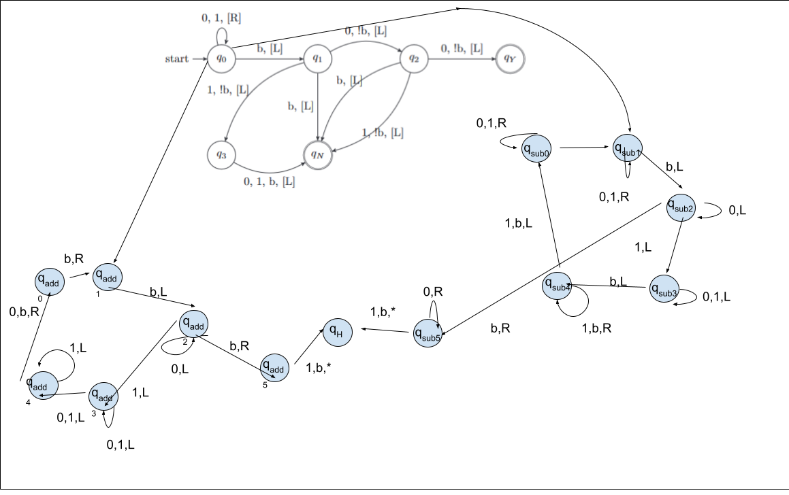

# Turing Machine
A Turing Machine which performs a specific routine(See figure 1), as well as binary addition & subtraction in python 3.

This project is for 605.621 Foundations of 
Algorithms. All output is displayed to a terminal console, or dumped into a text document if the number of transitions is above 30.

A sample driver is included which demonstrates 
the logic of the Turing Machine, which should be run in a terminal. It will run through test cases, and then allow you to input your own tapes.
dtm.py contains the Turing Machine class.

M = 

    Γ : 0,1,b,+,-    
    Q : q0,q1,q2,q3 q_add0,q_add1,q_add2,q_add3,q_add4,q_add5 q_sub0,q_sub1,q_sub2,q_sub3,q_sub4,q_sub5 qH qY qN
    S : -1,+1,0 (left,right,halt)
    δ : shown in self.transitions
    Σ ⊂ Γ : symbols in input
    b ∈ Γ - Σ : b (blank symbol)

## Possible changes:
- Add Binary Multiplication function
- Improve output formatting
- Add additional error checking

## Tables & Figures:
|        Table 1: DTM model illustrated in Module 3.       |
|-----------------------|
| |

|        Figure 2:A DTM state diagram of Table 1.          |
|---------------------------|
|        |

|        Figure 2:A messy DTM state diagram of the turing machine           |
|---------------------------|
|        |

* If the images do not load please check the subfolder, as it relies on the images being in the same directory.